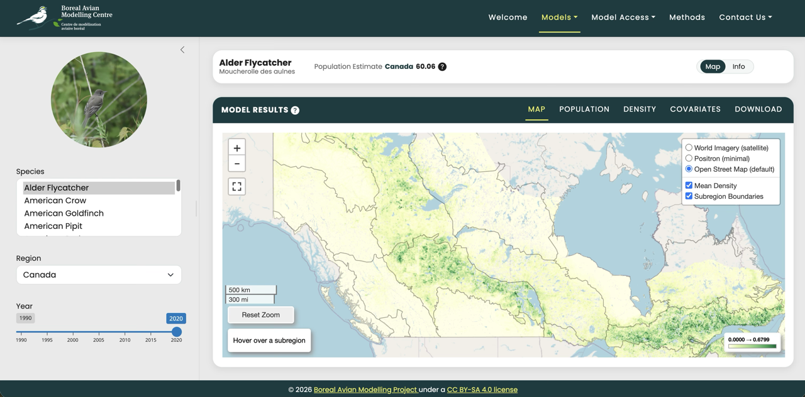
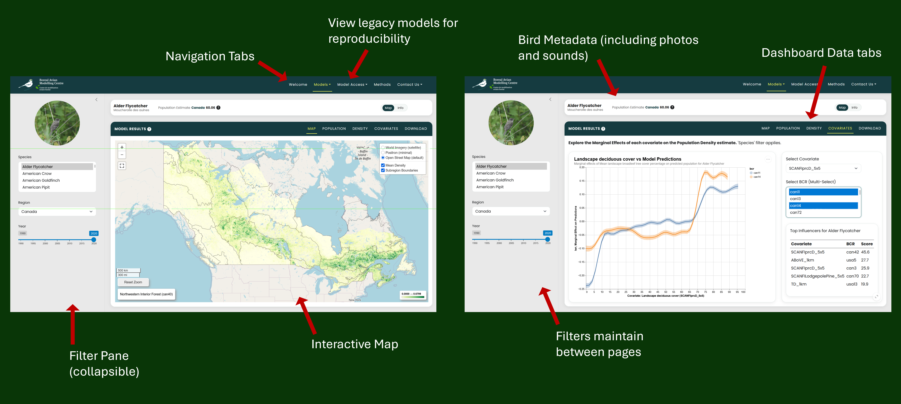
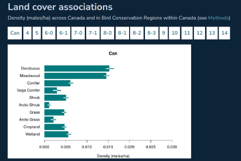
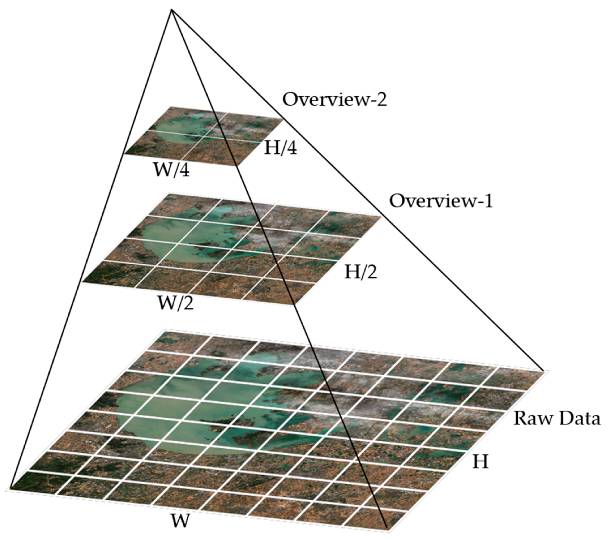
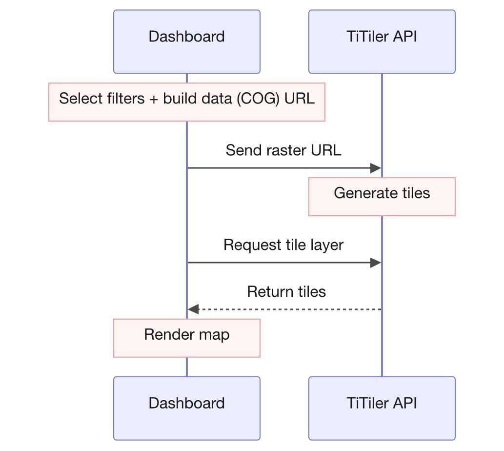
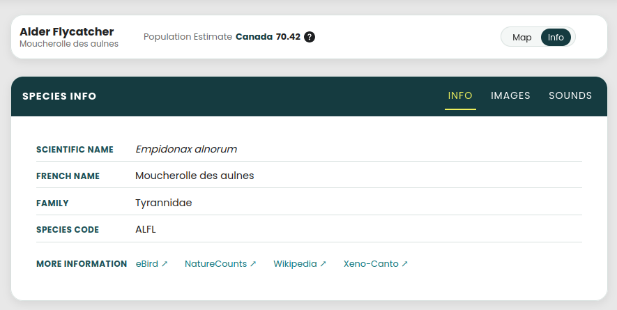
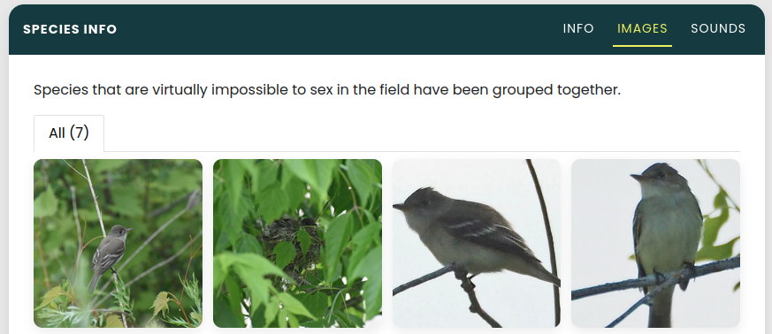
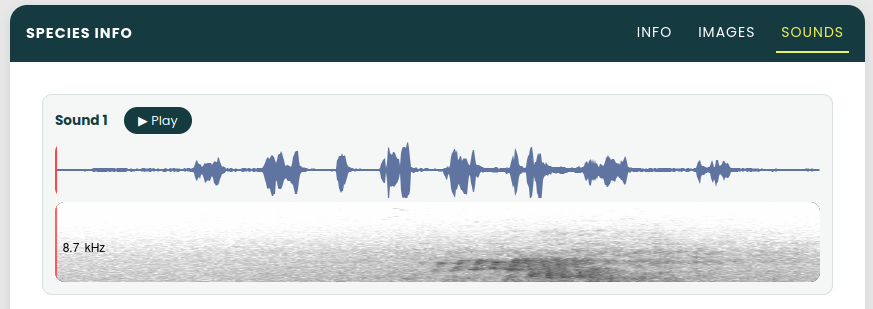

\newpage

## Executive Summary

The Boreal Avian Modelling Centre (BAM) required a transition from static visuals to a high-fidelity, interactive, analytic platform. The previous [site](https://borealbirds.github.io/ "BAM static website"), which showcases Landbird version 4 (V4) model results, is restricted to data tables and static summaries for 143 species of birds across boreal North America. Landbird version 5 (V5) model results introduced improved raster predictions, spatially explicit density estimates, and habitat relationship metrics. We took these improvements and included them on a fully new dashboard.

We designed the dashboard to be user-friendly and accessible to a wide range of audiences including research and conservationist-based users, as well as birding enthusiasts and the general public. It allows the user to interactively explore Landbird V5 model outputs while linking back to V4 for historical purposes. As well as serving as a landing page for visitors, the dashboard provides easy-access to the existing tools and methods in the BAM portfolio.

@fig-v5-main-page showcases the progress made and what the current page of the V5 model results looks like. We've included filters, an interactive map, and several additional charts and download capabilities.

{#fig-v5-main-page}

## Introduction

### Addressing the Issue

The project motivation is to improve upon and enhance the current static Boreal Avian Modelling Centre (BAM) website.

As the current website does not allow for user input or interaction, this limits the ability to dive in and explore the avian model outputs. As the current audience is mostly advanced users familiar with the domain and statistical software, ensuring a wider level of accessibility can expand end-user reachability.

### Background & Importance

A mandate of BAM's is to support migratory bird management and conservation across the boreal region of North America for 143 species of birds. Using data-driven tools, these applications include:

- bird population and trend estimations

- land-use planning

- understanding of avian-habitat relationships

- ability to investigate population decline of a specific species

To properly address conservation challenges, the tools created should be simple and effective for anyone to use.

### Objectives

@fig-existing-website provides elements from the current BAM website, which will be incorporated into the improved design using @fig-proposed-dashboard as guidance.

High level objectives include:

- Static to dynamic website, changing via user input - maintaining existing figures and visuals.
- Filters, an interactive map, and additional summaries and visuals.
- Accommodate historic and future model versions for reproducibility and validation of performance. (Outputs from earlier models have been thoroughly vetted.)
- Accessible by the general public - serve as a landing page for BAM with links to other existing BAM products and information.

{#fig-existing-website}

### The Product

The final deliverable is an interactive dashboard allowing users to explore outputs of models v4, v5, and ongoing. In an effort to maintain CI/CD, the elements of the dashboard have been modularized and future-proofed to enable simple plug-and-play when new models are created by BAM. @fig-dashboard-features showcases the landing page and elements of the proposed dashboard.

Keeping with a simple and minimalist approach, we've limited the number of filters and visuals to the most important. Additional components are housed under tabs reducing scrolling by collating related information together, making searching and navigation more intuitive.

{#fig-dashboard-features}

\newpage

## The Data

### Basic EDA

The main data scope for the dashboard includes model outputs only. These files are stored on Google Drive and include the following:

- **Raster files** **(TIF format)** - For each bird species, the main output of the model containing 3 bands: mean density, standard deviation of density, and the mean distance of species detection.
- **Excel files** - Metadata associated with the bird species, region, and importance of the features.
- **CSV files** - The input to the model, including raw observations binned by Lat/Lon. Used to distinguish between different methods of bird spotting.

For EDA purposes, a single species of bird, the **Canada Warbler**, was used.

Initial EDA for investigating what to expect from the TIF files involved plotting the different color bands shown below in @fig-raster-bands.

```{python}
#| label: fig-raster-bands
#| fig-cap: Split of Raster Data into Bands
#| echo: false

# import rasterio
# from rasterio import *
# import matplotlib.pyplot as plt

# def plot(data):
#     fig, ax = plt.subplots(1, 3, figsize=(12, 4))

#     img = rasterio.open(data)

#     cmaps = ["Mean Abundance", "SD Abundance", "Mean Distance to Species Detection"]
#     bands = ["var 1", "var 2", "var 3"]
#     for band in [1, 2, 3]:
#         ax[band-1].imshow(img.read(band), cmap="YlGn")
#         ax[band-1].set_title(cmaps[band-1])
#         ax[band-1].axis("off")
#     plt.tight_layout()
#     plt.show()

# # Change these selections as needed
# species = 'CAWA'    # BBMA
# region = 'Canada'   
# year = '2020'       # 2015

# filename = f"../data/{species}_{region}_{year}.tif"

# plot(filename)
```

### Data Concerns and Constraints

- Finely detailed raster (TIF): The native TIF files are \~800K predictions per output. This entire high-res output is unnecessarily loaded for every interactive adjustment; even when zooming into a specific region.
- [Coordinate Reference System (CRS)](https://epsg.io/ "CRS EPSG lookup") adjustment: The TIFs arrive formatted with the EPSG:3978 (Statistics Canada Lambert) CRS . This does not allow for caching and every render triggers a full coordinate transformation pass.
- Eager Loading of data: Every filter adjustment triggers a full TIF decode, CRS transformation, and PNG/COG encoding. This bogs down the UI resulting in a laggy and inefficient user experience.

To address this, we are exploring options using the [Cloud-Optimized GeoTIF](https://cogeo.org/ "Cloud-Optimized GeoTIF (COG)") format (COG). COG is analogous to Parquet for tabular data, using internal tiling and HTTP range requests to only render what is being displayed. We are also investigating alternate Lazy-Loading options within Shiny for R, which will be discussed with BAM to ensure future maintainability.

The initial EDA was conducted in *Jupyter Notebooks* and with a locally-run *Shiny App,* which can be reproduced by installing the conda [environment](https://github.com/UBC-MDS/Boreal-Birds/blob/main/environment.yml "environment.yml file") and following the instructions in the [README](https://github.com/UBC-MDS/Boreal-Birds/blob/main/README.md "Boreal-Birds README").

\newpage

## Data Science Approach

### Data Pipeline

@fig-data-pipeline maps out our main pipeline for the dashboard. Following is a breakdown of the individual components of the pipeline.

{#fig-data-pipeline}

#### Data Input

There are 2 data streams which are ingested into the dashboard: outputs from the model and static metadata. The model outputs consist of the different TIF files, one for each species, location, and year in the dataset. The metadata includes information relating to the bird species (including English names, Latin names, genus etc.), location, and region. These will primarily feed into the main filters of the dashboard.

Currently, these files are stored on a Google Drive which are subjected to extended loading (and downloading) times. To improve on speeds, we suggest pre-loading these model outputs to a SQL (or equivalent) database which can be queried through the dashboard's back-end for friction-less responses. Another method which can be applied in congruence is to cache the most frequently loaded data. These approaches will enable fast retrieval and on-demand structured data validation. All approaches to be discussed with BAM.

#### Preprocessing

The preprocessing step has been moved upstream and is conducted once. The preprocecssing includes -

- conversion of raster files to appropriate CRS projection,
- conversion of raster files to COG,
- validating metadata,
- validating and aggregating GAM model outputs.

#### App

The Shiny app consists of a server and UI. Basic render targets (incorporated by the server) include the following:

- **Bird metadata** - A static table of metadata that can be sliced by filters.
- **Filters** - The filters incorporate metadata from the excel file. These serve as lookup tables for the dashboard and will feed into the main filters in the UI.
- **Main raster** - Simple loading of the different raster bands to memory.
- **Metrics** - Extraction of metrics (mean, sd of abundance, distance from detectors), from raster file.

There is an opportunity for further data metrics derived which shall be explored at a later data and in consultation with BAM.

#### Front End

The front end of the dashboard includes the following visuals - there is opportunity for additional visuals based on feedback and consultation. These will be addressed after the basic structure of the dashboard has been implemented.

- @fig-dashboard-map An interactive map that follows the following format.
- @fig-dashboard-bar-chart A bar chart showing the population densities by region.
- @fig-dashboard-static-table A static table containing raw numeric metrics.

::: {#fig-front-end layout-nrow="2"}
{#fig-dashboard-map}

{#fig-dashboard-bar-chart}

{#fig-dashboard-static-table}

Front End Visuals
:::

\newpage

## Data Architecture and Dynamic Raster Rendering

### Dataset Composition and Scale

The dashboard serves as the visual interface for high-resolution bird population models. These models represent a massive computational effort; they are trained on approximately 1.5 million bird surveys and created by compiling nearly 800,000 individual predictions. To ensure stable performance, the dashboard is designed strictly to visualize these pre-computed model outputs.

The project uses three distinct types of data, each playing a specific role within the application:

* **Spatial Raster Layers (Primary Dataset):** Mean population density estimates modeled across 151 bird species, 3 geographic regions, and 7 years ($1990\sim2020$). This combination creates thousands of individual raster layers that must be managed and rendered on demand.
* **Tabular Metadata (Excel):** Attributes containing Bird Conservation Region (BCR) definitions, species taxonomy, and overall population estimates. The dashboard reads this file to fill out user-interface filters and show summary statistics.
* **Environmental Covariates (CSV):** Data showing how individual environmental factors affect population density estimates. These files run the dashboard's interactive charts, letting users explore what drives predicted bird abundance.

All of these data assets are stored remotely on servers managed by the **Digital Research Alliance of Canada (DRAC)**.

### Cloud Optimized GeoTIFFs (COGs)

To handle thousands of high-resolution rasters without downloading the entire dataset locally, the spatial layers are formatted as **Cloud Optimized GeoTIFFs (COGs)** [@cog_website].

A COG is a standard GeoTIFF file that supports efficient, partial data access over the internet using standard HTTP GET range requests. This format avoids forcing a client application to download an entire raster file before it can display any data.

{#fig-cog-pyramid}

As shown in @fig-cog-pyramid, COGs rely on two main features to speed up map rendering performance:

1. **Internal Overviews:** The file contains downsampled, lower-resolution versions of the original raster data organized in a pyramid structure. When a user zooms out to a wider view, the map requests a low-resolution overview instead of the raw, heavy pixel grid.
2. **Dynamic Tiling:** The pixel data is split and stored in discrete, uniform tiles (typically $256 \times 256$ blocks). This layout allows the rendering engine to find and stream only the specific spatial tiles currently visible on the user's dashboard screen.

### Tile Server Evaluation and Infrastructure Selection

While COGs optimize how data is stored, web browsers cannot render raw geospatial data blocks directly. A tile server is required to act as middleware, translating raw pixel values into standard web image tiles on the fly.

During the architecture design phase, two tile-serving solutions were evaluated:

| Criterion | LocalTileServer | TiTiler (Selected) |
| --- | --- | --- |
| **Development Environment** | Local development | Cloud-native |
| **Data Loading** | Requires raster files to be stored locally | Loads remote files directly via HTTP Range requests. |
| **Project Fit** | **Incompatible:** App stalled when trying to read from remote DRAC storage. | **Ideal:** Built specifically to work smoothly with remote COG web addresses. |

Because our entire raster collection lives on a remote DRAC server, **TiTiler** [@titiler_software] was chosen as our central tile engine.

---

### Map Rendering Workflow with TiTiler

The TiTiler application is built on the FastAPI framework [@fastapi_framework] wrapped in a Shiny application deployed on Posit Connect Cloud using Python.

{#fig-titiler-workflow}

As illustrated in @fig-titiler-workflow, the frontend dashboard, the DRAC cloud storage, and TiTiler work together in a synchronized pipeline to generate maps on demand:

1. **User Selection:** The user changes a filter on the dashboard UI, selects a specific species, region, and year.
2. **URL Construction:** The dashboard backend builds the exact HTTP URL for the target COG stored on the DRAC server.
3. **API Request:** The dashboard sends this COG URL—along with styling choices like color maps and data display ranges—as query parameters to the TiTiler API.
4. **Remote Byte Extraction:** TiTiler sends HTTP range requests to the DRAC server. It reads only the specific byte sections for the tiles and overview levels needed for the user's current zoom level and view.
5. **Dynamic Tiling:** TiTiler processes the raw data bytes, applies the chosen color map, and converts the data into standard web map image tiles (such as PNG or WebP format).
6. **Map Display:** The dashboard's map client (`ipyleaflet` / Leaflet) receives the tile URL from TiTiler, updating the map smoothly as the user pans or zooms.

Hosted on Posit Connect Cloud

## Data Product and Results

### Bird Species Details

#### General Information

Species information is displayed through the toggle from *Map* to *Info* and selecting the *Info* tab from the 3 tab options. On a simple UI card, the scientific name, French name, species family, and species code are displayed in a clean and clear layout with links to 4 additional resources for further literature selectively directed towards the selected species.

Additional links are to: [eBird](https://ebird.org/home), [NatureCounts](https://www.naturecounts.ca/nc/default/main.jsp), [Wikipedia](https://en.wikipedia.org/wiki/Bird), [Xeno-Canto](https://xeno-canto.org/)

- @fig-dashboard-info A basic UI card to display species names, species code, and links.



#### Images and Sounds

The images and sounds were obtained through APIs for conservation sites like [Xeno-Canto](https://xeno-canto.org/) and [iNaturalist](https://www.inaturalist.org/). Asset metadata values and tags were utilized to fine tune the download scripts and to refine the desired image and sound parameters. The script for Image downloads attempted to retrieve 10 images per species tagged as a living specimen and aiming for 5 male and 5 female. As about \~3% of images were of poor quality or incorrectly tagged in the metadata manual review and intervention was required for the final quality control of the product. As some bird species are virtually impossible to sex in the field or from an image, the images for these species were binned together in the *All* bucket.

- @fig-dashboard-images-1 The *Images* tab of the Alder Flycatcher - which cannot be sexed



As the sex of many bird species *can* be identified visually, for the species where the sex and relative metadata was manually verified the UI displays 3 bins for *All, Male*, and *Female,* including a check-box to toggle on symbols to subtly label the images with the sexes.

- @fig-dashboard-images-2 The *Images* tab of the Pine Grosbeak with sex labels


The script for sounds attempted to retrieve 2 sounds per bird species, with a length under 7 seconds, and with a quality rating of B or higher within to the sound's metadata. If no sounds were available under 7 seconds then the script would attempt to search for a length of up to 10 seconds, then 15 seconds, and finally allow for 1 sound at 20 seconds. This was to methodically keep asset sizes low because of the volume of assets and considering the storage on GitHub alongside the dashboard code.

Sounds are displayed by selecting the *Sounds* tab and reveal a standard waveform visual with a play button and red line that animates through the waveform as the play-head. Underneath each waveform shows a condensed grey-scale spectrogram which has a tool-tip on hover: "Click for full spectrogram", allowing the user to click the UI and expand the spectrogram fully in a separate modal screen.

- @fig-dashboard-sounds The *Sounds* tab of the American Robin - waveform & spectrogram



The spectrogram modal screen shows the fully expanded dynamically calculated spectrogram for the selected species. The modal also displays the source, attributions, and metadata, along with options for grey-scale, viridis, or magma plotting themes with additional option to invert color-scale.

- @fig-dashboard-spectrogram The expanded spectrogram modal for the American Robin


### Model Results and Exploration

#### Map

BAM's model produces raster data on predicted estimates. There current website only allowed the user to view a static map image of these. There was no option to zoom in and pan around. The BCR boundaries were only available through the 'Methods' page and not layered directly onto the map. Additionally, with the introduction of Landbirds v5, the number of BCRs increased with the introduction of mosaics that included Alaska and the Lower 48 areas. These all needed to be displayed and filtered in more interactive way than the current site allowed. 

Our dashboard eliminated most of what the static site lacked. Rather than having to navigate to a separate species page, the user is able to stay on one page to explore the map details of the species, region, and year they are interested in. This enhances usability.

We also wanted the map to be more dynamic and interactive than before. We included different zoom capabilities, map scale, and a dynamic legend. The boundaries also included a hover-to-outline feature to further identify what BCR a user was looking at. 

It was also noted at a BAM meeting, that different basemaps were prefered by different users. To address this, our default basemap is Open Street Map, but we provided Positron for a more minimal look and World Imagery for those who would also like to display satellite details. Additional toggles allows the user to turn the mean density and boundaries on and off, depending on the view they are interested in exploring.

##### Interactive Map Features

To complement the dynamic raster tile pipeline, the interactive map layer includes several user-experience and navigation features implemented via the client-side mapping interface:

* **Dynamic BCR Highlighting**: When a user hovers the cursor over a Bird Conservation Region (BCR) boundary, the map dynamically highlights the region's border to provide immediate visual feedback. Simultaneously, the specific name of the hovered BCR is displayed in an information overlay positioned in the bottom-left corner of the map.
* **Contextual Navigation**: Clicking directly on a BCR triggers an automated event that centers the map and adjusts the zoom level to fit the selected region's boundaries, allowing for quick, localized data exploration.
* **Global Reset**: A dedicated "Reset Zoom" control button is available on the map interface. Clicking this returns the viewport back to the initial, full-scale geographic boundary of the study area.
* **Basemap Toggling**: The map interface supports multiple basemaps (e.g., satellite imagery, topographic maps, and minimalist terrain backgrounds). Users can toggle between these choices at any time to improve data contrast and visibility.
* **Automated Legend Generation**: The map legend is dynamically calculated using TiTiler's statistical analysis endpoints (/statistics). When a user updates the species or region filters, the dashboard queries TiTiler to get the exact data distribution (minimum, maximum, and percentiles) of the underlying remote COG file. The application uses these real-time metrics to calculate color scales and update the legend values on the map.

#### Population and Density Estimates

The next element of the dashboard looked at the mean population and density estimates, generated by the model, for each BCR. Not only the point estimate itself, but the 5th and 95th percentile of the overall bootstrap distribution were included.

The current BAM model website displays the results from the version 4 model as values on a table. As important as this information is to have, viewing the results this way makes comparisons challenging and relying on the reader to try and visualize the size of the percentile ranges. This makes it hard to meaningfully compare the estimate of one BCR against one another.

Using the plotting package, Altair, these point estimates became much easier to compare. Subsequently, layering them with their percentile intervals provided the much needed visual ques as which ranges where wider than others.
and layered them over their corresponding intervals.

Using the Altair package helped us address this issue relatively simply, as its documentation is straightforward and accessible should the charts need to be updated, changed, or new ones developed.

We didn't simply leave off the population and density estimates from the dashboard; there are potential user who may find a table of use. To address this need, we created a dynamically-filtered table of these values and the ability to download them in an additional location on the dashboard.  

#### Covariates

BAM requested the creation of a visual to track the inner workings of the population prediction model. To address this, we created a UI element to measure the marginal effects of the covariates against the model predictions. Each model input variable (covariate) was fitted with a Generalized Additive Model (GAM), against the model predictions, to measure its isolated effect. 

![placeholder figure]

The chart shows the marginal effect of the selected covariate (Annual Precipitation) against the model population prediction, for the selected bird species (Alder Flycatcher). We can infer from this simple chart that higher values of annual rainfall in the region `can40` are associated with lower predicted population density for the Alder Flycatcher, holding all other variables constant.

The chart can be dynamically filtered for each covariate and bird species in the model. The available options for BCR change dynamically based on whether the data exists. For example, the Alder Flycatcher is unlikely to be found in the region `usa4`, hence this option does not show up. Multiple BCR's can be selected to view how the covariate affects the predictions across regions.

The table in the bottom left corner shows the highest influencing covariates and regions for a selected bird species. This was calculated using the `importance` score outputted directly from the model.

![plcaeholder figure]

The GAM experiments were conducted for each bird species and BCR region in the dataset, resulting in a lot of data. This meant that server-side processing was out of the question. To address this, the team decided to move the data processing upstream, and save the model output results to the existing DRAC server. On load, the dashboard requests the user filtered data from the server and swaps it out as the user changes the filter. This is done to prevent memory overflow, while still maintaining a smooth user experience and feel.

#### Download

Our next UI component involves getting the model results into the user’s own hands and extends upon our discussion related to the Population and Density Estimates. 

BAM's original V5 website provided the option for the user to access and download the model results should they be inclined to do their own investigation and exploring; every species page had this option.

Even though several ways to filter and visualize the results are present on the dashboard, there is a limited use and a challenge in creating a dashboard that caters to every possible analytical technique without making a tool that is bloated and complicated to use.

To overcome this issue, and being fortunate to have public results, downloading capabilities was a must for the dashboard. Althought the original BAM website provided the ability to download all the results, it lacked the capability to apply filters.

The dashboard provides two ways of downloading the model results: all species results and those results based on the applied filter. And in keeping with what BAM would like to provide the download not only includes the population and density estimates, but species taxonomy, model metadata, and additional information on the model regions and variables themselves. 

Housed all in one download tab, this makes it much easier for users to access what they are looking for and only requires updating the filters to retrieve another species data (should that be the desire over all). Achieved our goal to be simple and clear.

### Text-Heavy Elenents

Here we shift away from model results and focus on the communication aspect of the project. With BAM being an organization that spans national boundaries, and including international outputs, organizing and displaying the text-heavy communication elements of the project was deemed of high importance.

Our main considerations can be seen in the culmination of the "Welcome," "Model Access," and "Methods" pages. BAM has lots of text related to the purpose of the project, method explanations, how to cite results, accessing additional model products, to name a few. All need to be considered and housed somewhere on the dashboard.

The goal here was to create a backend that could be easily updated and understood by anyone who would be maintaining the communication and documentation related to the dashboard. This would reduce any changes that could have impacted the code that renders and runs the dashboard.

Each of the afore mentioned pages included content that originally lived on the BAM website and needed a place on the dashboard. Not only that, but some of the content could be found in several places. This not only meant multiple places would need to be updated each time there was a change, but also lacked a consistent pattern for users to follow in finding the information they needed.

Structuring the content the way we did-everything housed in a 'contents' directory-eliminated the need for several locations to be edited each time. We aimed to create a single source of truth. This way if information did need to be diplayed in multiple locations, only one file need be referenced and maintained.

There were also a couple other reasons we chose this method. Firstly, moving this text outside of the main dashboard codebase made for reading, editing, and understanding much easier. And secondly, we also chose to use markdown format for all of the text-heavy elements. This allowed for simple formating and markdown's inherent syntax to be used.

### Alternative Approaches and Future Improvements

Hosting

After working through the project and discussing ideas with the partners, there are a couple of future improvements that we would have liked to tackle given a longer timeframe.

Currently, the main model page does not permit multi-select of species: only one species and details can be viewed at a time. 

French-language support


\newpage

# Conclusions and Recommendations

At the outset of the project, we aimed to improve the accessibility and reach of BAM's Boreal Bird Species Results through a new and comprehensive interactive dashboard. We took what was a static website, with minimal charts and interactive components, and created a data product that more than exceeded our expectations. 

As we handover the project, there are few comments and recommendations we'd like to make. Firstly, each species has images and sounds. Having the framework and structure inplace, adding more curated media components could elevate this aspect of the dashboard. 

Secondly, hosting the Titiler service on their own servers could see added improvements.

And lastly, this is something that BAM is already aware of, relates to the regions. It would be fantastic to be able to display all regions on the map at once. Understandably it would take some effort to make the model results line up near the geographical borders, we believe this would be valuable for users wanting to display all results as well. This would also be helpful should future models be expanded to include additional regions.

\newpage

## References

**Boreal Avian Modelling Centre**

- Organisation website: <https://borealbirds.github.io/>
- Google Earth Engine viewer: <https://borealbirds-gee.projects.earthengine.app/view/landbirdmodels>
- BAM Shiny explorer: <https://borealbirds.shinyapps.io/bam_landbird_explorer/>
- BAMexploreR R package: <https://github.com/borealbirds/BAMexploreR>
- Landbird Models V5: <https://github.com/borealbirds/LandbirdModelsV5>
- BAM website repository: <https://github.com/borealbirds/borealbirds.github.io>
- Cloud Optimized GeoTIF (COG): <https://cogeo.org/>
- Coordinate Reference System EPSG lookup: <https://epsg.io/>

**Capstone Project Working Repository**

-   UBC MDS Boreal-Birds: <https://github.com/UBC-MDS/Boreal-Birds>
-   README: <https://github.com/UBC-MDS/Boreal-Birds/blob/main/README.md>
-   UBC MDS MapTiler: <https://github.com/UBC-MDS/MapTiler>
-   README: <https://github.com/UBC-MDS/MapTiler/blob/main/README.md>
