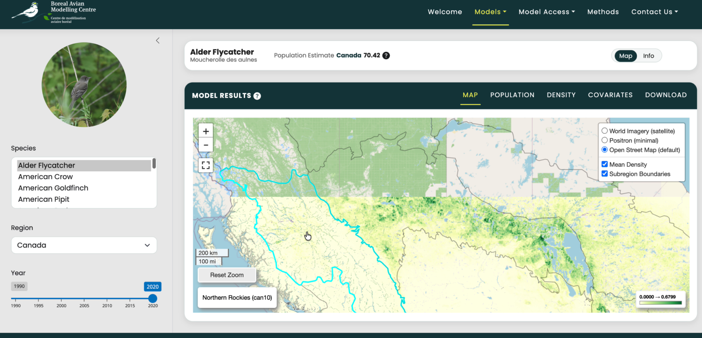
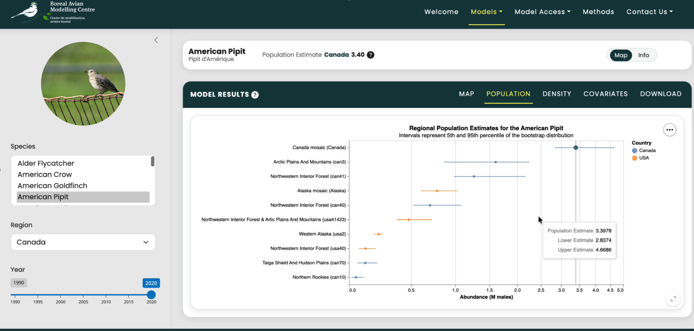
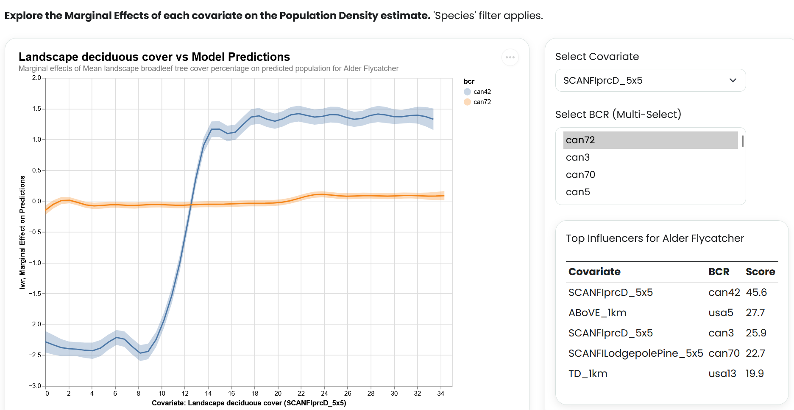
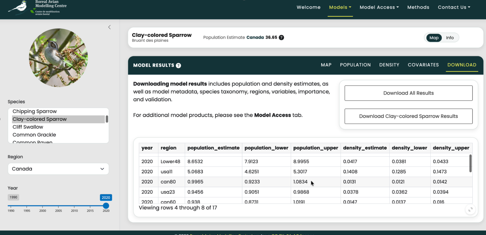
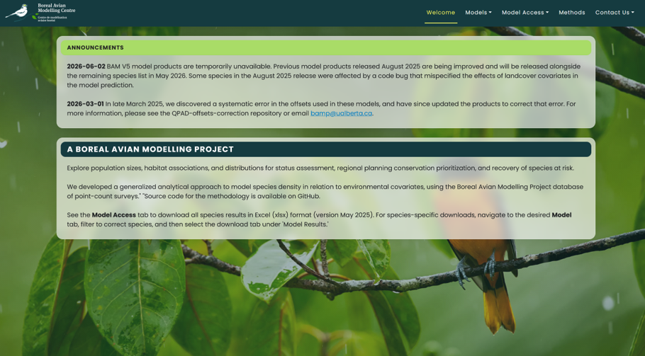
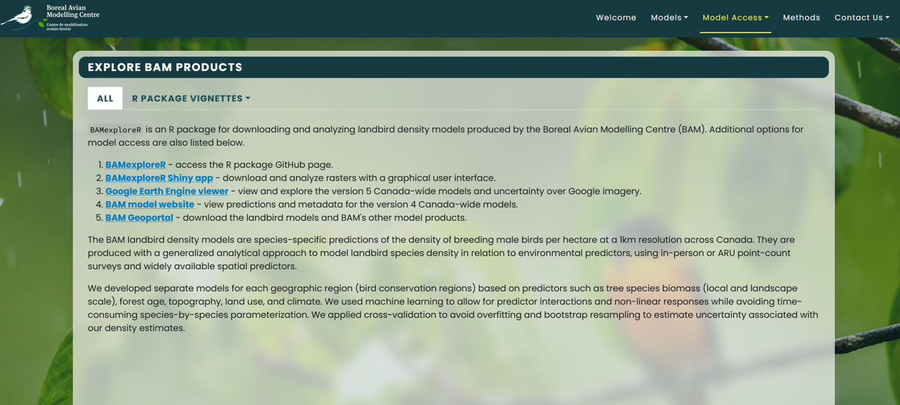

\newpage

## Executive Summary

The Boreal Avian Modelling Centre (BAM) required a transition from static visuals to a high-fidelity, interactive, analytic platform. The previous [site](https://borealbirds.github.io/ "BAM static website"), which showcases Landbird version 4 (V4) model results, is restricted to data tables and static summaries for 143 species of birds across boreal North America. Landbird version 5 (V5) model results introduced improved raster predictions, spatially explicit density estimates, and habitat relationship metrics. We took these improvements and included them on a fully new dashboard.

We designed the dashboard to be user-friendly and accessible to a wide range of audiences including research and conservationist-based users, as well as birding enthusiasts and the general public. It allows the user to interactively explore Landbird V5 model outputs while linking back to V4 for historical purposes. The dashboard provides easy-access to the existing tools and methods in the BAM portfolio.

@fig-v5-main-page showcases the final layout of the V5 model page on the dashboard. We've included filters, an interactive map, several charts, and download capabilities.

{#fig-v5-main-page}

\newpage

## Introduction

The project motivation was to improve the current static landbird V4 Boreal Avian Modelling Centre (BAM) website @fig-existing-website.

{#fig-existing-website}

In collaboration with BAM, the following high level objectives were achieved:

- Static website to dynamic dashboard, while maintaining and enhancing existing figures and visuals.
- Key filters, an interactive map, and population, density, and covariate summaries.
- Downloadable results and links to existing BAM products.
- Additional information related to each species including images, and sounds. 
- Accessible to the general public and scientific community.

\newpage

## Data

### Dataset Composition and Scale

The dashboard serves as the visual interface for high-resolution bird population models. These models represent a massive computational effort; they are trained on approximately 1.5 million bird surveys and created by compiling nearly 800,000 individual predictions. To ensure stable performance, the dashboard is designed strictly to visualize these pre-computed model outputs.

The project uses three distinct types of data, each playing a specific role within the application:

* **Spatial Raster Layers (Primary Dataset):** Mean population density estimates modeled across a growing number of bird species, 3 geographic regions, and 7 years ($1990\sim2020$). This combination creates thousands of individual raster layers that must be managed and rendered on demand.
* **Tabular Metadata (Excel):** Attributes containing Bird Conservation Region (BCR) definitions, species taxonomy, and overall population estimates. The dashboard reads this file to fill out user-interface filters and show summary statistics.
* **Environmental Covariates (CSV):** Data showing how individual environmental factors affect population density estimates. These files run the dashboard's interactive charts, letting users explore what drives predicted bird abundance.

All of these data assets are stored remotely on servers managed by the **Digital Research Alliance of Canada (DRAC)** [@drac].

\newpage

## Data Science Methods

### Cloud Optimized GeoTIFFs (COGs)

To handle thousands of high-resolution rasters without downloading the entire dataset locally, the spatial layers are formatted as **Cloud Optimized GeoTIFFs (COGs)** [@cog_website].

A COG is a standard GeoTIFF file that supports efficient, partial data access over the internet using standard HTTP GET range requests. This format avoids forcing a client application to download an entire raster file before it can display any data.

{#fig-cog-pyramid}

As shown in @fig-cog-pyramid, COGs rely on two main features to speed up map rendering performance:

1. **Internal Overviews:** The file contains downsampled, lower-resolution versions of the original raster data organized in a pyramid structure. When a user zooms out to a wider view, the map requests a low-resolution overview instead of the raw, heavy pixel grid.
2. **Dynamic Tiling:** The pixel data is split and stored in discrete, uniform tiles (typically $256 \times 256$ blocks). This layout allows the rendering engine to find and stream only the specific spatial tiles currently visible on the user's dashboard screen.

### Tile Server Evaluation and Infrastructure Selection

While COGs optimize how data is stored, web browsers cannot render raw geospatial data blocks directly. A tile server is required to act as middleware, translating raw pixel values into standard web image tiles on the fly.

During the architecture design phase, two tile-serving solutions were evaluated (@tbl-tile).

| Criterion | LocalTileServer | TiTiler (Selected) |
| --- | --- | --- |
| **Development Environment** | Local development | Cloud-native |
| **Data Loading** | Requires raster files to be stored locally | Loads remote files directly via HTTP Range requests. |
| **Project Fit** | **Incompatible:** App stalled when trying to read from remote DRAC storage. | **Ideal:** Built specifically to work smoothly with remote COG web addresses. |

: Tiling Options {#tbl-tile}

Because our entire raster collection lives on a remote DRAC server, **TiTiler** [@titiler_software] was chosen as our central tile engine.

\newpage

### Map Rendering Workflow with TiTiler

The TiTiler application is built on the FastAPI framework [@fastapi_framework] wrapped in a Shiny application deployed on Posit Connect Cloud using Python.

{#fig-titiler-workflow}

As illustrated in @fig-titiler-workflow, the frontend dashboard, the DRAC cloud storage, and TiTiler work together in a synchronized pipeline to generate maps on demand:

1. **User Selection:** The user changes a filter on the dashboard UI, selects a specific species, region, and year.
2. **URL Construction:** The dashboard backend builds the exact HTTP URL for the target COG stored on the DRAC server.
3. **API Request:** The dashboard sends this COG URL—along with styling choices like color maps and data display ranges—as query parameters to the TiTiler API.
4. **Remote Byte Extraction:** TiTiler sends HTTP range requests to the DRAC server. It reads only the specific byte sections for the tiles and overview levels needed for the user's current zoom level and view.
5. **Dynamic Tiling:** TiTiler processes the raw data bytes, applies the chosen color map, and converts the data into standard web map image tiles (such as PNG or WebP format).
6. **Map Display:** The dashboard's map client (`ipyleaflet` / Leaflet) receives the tile URL from TiTiler, updating the map smoothly as the user pans or zooms.

\newpage

## Data Product and Results

Keeping with a simple and minimalist approach, we limited the number of filters and visuals to the most important. Additional components are housed under tabs, reducing scrolling by collating related information together and making searching and navigation more intuitive.

{#fig-dashboard-features}

### Bird Species Details

#### General Information

Species information is displayed through the toggle from *Map* to *Info* and selecting the *Info* tab from the 3 tab options. On a simple UI card, the scientific name, French name, species family, and species code are displayed in a clean and clear layout with links to 4 additional resources for further literature selectively directed towards the selected species.

Additional links are to: eBird [@eBird], NatureCounts [@NatureCounts], [Wikipedia](https://en.wikipedia.org/wiki/Bird), Xeno-Canto [@Xeno-Canto]

- @fig-dashboard-info A basic UI card to display species names, species code, and links.

{#fig-dashboard-info}

#### Images and Sounds

The images and sounds were obtained through APIs for conservation sites like Xeno-Canto [@Xeno-Canto] and iNaturalist [@iNaturalist]. Asset metadata values and tags were utilized to refine the desired image and sound parameters. The script for Image downloads attempted to retrieve 10 images per species tagged as a living specimen and aiming for 5 male and 5 female. As about \~3% of images were of poor quality or incorrectly tagged in the metadata manual review and intervention was required for the final quality control of the product. Some bird species are virtually impossible to sex in the field or from an image, so the images for these species were binned together in the *All* bucket.

- @fig-dashboard-images-1 The *Images* tab of the Alder Flycatcher - which cannot be sexed

{#fig-dashboard-images-1}

- @fig-dashboard-images-2 The *Images* tab of the Pine Grosbeak with sex labels

{#fig-dashboard-images-2}

The script for sounds attempted to retrieve 2 sounds per bird species, with a length under 7 seconds, and with a quality rating of B or higher. If no sounds were available under 7 seconds, the script would attempt to search for a length of up to 10 seconds, then 15 seconds, and finally allow for 1 sound at 20 seconds. This was done to methodically keep asset sizes low, considering the storage on GitHub alongside the dashboard code.

Sounds are displayed by selecting the *Sounds* tab and reveal a standard waveform visual with a play button and red line that animates through the waveform as the play-head. Underneath each waveform shows a condensed grey-scale spectrogram which has a tool-tip on hover, allowing the user to expand the spectrogram fully in a separate modal screen.

- @fig-dashboard-sounds The *Sounds* tab of the American Robin - waveform & spectrogram

{#fig-dashboard-sounds}

The spectrogram modal screen shows the fully expanded dynamic spectrogram for the selected species. The modal also displays the source, attributions, and metadata, along with options for grey-scale, viridis, or magma plotting themes with additional option to invert color-scale.

- @fig-dashboard-spectrogram The expanded spectrogram modal for the American Robin

{#fig-dashboard-spectrogram}

### Model Results and Exploration

#### Map

Our dashboard eliminated most of what the static site lacked. Rather than having to navigate to a separate species page, the user is able to stay on one page to explore the map details of the species, region, and year they are interested in. @fig-map-visual

{#fig-map-visual}

The interactive map layer includes several user-experience and navigation features:

* **Dynamic BCR Highlighting**: When a user hovers the cursor over a Bird Conservation Region (BCR) boundary, the map dynamically highlights the region's border to provide immediate visual feedback. Simultaneously, the specific name of the hovered BCR is displayed in an information overlay positioned in the bottom-left corner of the map.
* **Contextual Navigation**: Clicking directly on a BCR triggers an automated event that centers the map and adjusts the zoom level to fit the selected region's boundaries, allowing for quick, localized data exploration.
* **Global Reset**: A dedicated "Reset Zoom" control button is available on the map interface. Clicking this returns the viewport back to the initial, full-scale geographic boundary of the study area.
* **Basemap Toggling**: The map interface supports multiple basemaps (e.g., satellite imagery, topographic maps, and minimalist terrain backgrounds). Users can toggle between these choices at any time to improve data contrast and visibility.
* **Automated Legend Generation**: The map legend is dynamically calculated using TiTiler's statistical analysis endpoints. When a user updates the species or region filters, the dashboard queries TiTiler to get the exact data distribution (minimum, maximum, and percentiles) of the underlying remote COG file. The application uses these real-time metrics to calculate color scales and update the legend values on the map.

#### Population and Density Estimates

The next element of the dashboard looked at the mean population and density estimates, generated by the model, for each BCR. Initially, displayed as a table on BAM's V4 website, a basic plot (@fig-population-estimates) showed us that we could greatly improve upon how these results were being displayed to the user. 

```{python}
#| label: fig-population-estimates
#| fig-cap: "Regional and BCR population estimates for the Alder Flycatcher"
#| echo: false

import pandas as pd
import matplotlib.pyplot as plt

df = pd.read_csv("data/alfl-estimate-results.csv")
df = df.sort_values("population_estimate")

fig, ax = plt.subplots(figsize=(8, 8))

ax.scatter(
    df["population_estimate"],
    df["region"],
    s=40
)

ax.set_xscale("symlog")
ax.set_xlabel("Abundance (M males)")

ax.set_ylabel("")

ax.set_title(
    "Regional and BCR Population Estimates for the Alder Flycatcher\n"
    "Intervals represent 5th and 95th percentile of the bootstrap distribution",
    pad=15
)

plt.tight_layout()
plt.show()
```

In the final dashboard, we used the plotting package, Altair, to visualize the mean population and density estimates. We layered this with their 5th and 95th percentile intervals. This provided the much needed visual cues as to which estimates were greater and which ranges where wider. @fig-density-visual illustrates the final state.

{#fig-density-visual}

#### Covariates

BAM requested the creation of a visual to track the inner workings of the population prediction model. To address this, we created a UI element to visualize the marginal effects of the covariates against the model predictions. Each model input variable (covariate) was fitted with a Generalized Additive Model (GAM), against the model predictions, to measure its isolated effect. (These results were provided to us by BAM.) @fig-covariates-visual shows this UI element.

{#fig-covariates-visual}

The chart can be dynamically filtered for each covariate and bird species in the model. The available options for BCR change dynamically based on whether the data exists. For example, the Alder Flycatcher is unlikely to be found in the region `usa4`, hence this option does not show up. Multiple BCR's can be selected to view how the covariate affects the predictions across regions.

#### Download

Our next UI component involves getting the model results into the user’s own hands. Being fortunate to have public results, downloading capabilities was a must for the dashboard. Although the original BAM website provided the ability to download all the results, it lacked the capability to apply filters. 

Our current dashboard provides two ways of downloading the model results: all species results and those results based on the applied filter @fig-download. As well as the population and density estimates; the user can also download species taxonomy, model metadata, and additional information on the model regions and variables themselves. 

{#fig-download}

Achieving our goal to be simple and clear, being located in one download tab, this makes it much easier for users to access what they are looking for and only requires updating the filters to retrieve another species data. 

### Text-Heavy Elements

Here we shift away from model results and focus on the communication aspect of the project. With BAM being an organization that spans national boundaries, and including international outputs, organizing and displaying the text-heavy communication elements of the project was deemed of high importance.

Our main considerations can be seen in the culmination of the "Welcome," "Model Access," and "Methods" pages, each conataining text related to purpose, method explanations, citations, accessing additional model products, and more @fig-text-heavy. Primarily, the goal, here, was to create a backend that could be easily updated and understood by anyone who would be maintaining the communication and documentation related to the dashboard. Secondly, we also chose to use markdown format for all of the text-heavy elements. This allowed for simple formatting and markdown's inherent syntax to be used.

To address this, we housed everything in a 'contents' directory, eliminating the need for several locations to be edited each time. This way if information did need to be diplayed in multiple locations, only one file need be referenced and maintained.

::: {#fig-text-heavy layout-ncol="1"}
{#fig-welcome}

{#fig-model-access}

Text-heavy page elements
:::

### Alternative Approaches and Future Improvements

After working through the project and discussing ideas with the partners, there are a couple of future improvements that we would have liked to tackle given a longer timeframe.

- **Multi-select support:** Currently, the main V5 model page does not permit multi-select of species: only one species and details can be viewed at a time. 
- **French-language support:** The existing dashboard is English-based. Given the national scope of BAM, adding French language support would be beneficial.
- **Hosting:** The dashboard currently is hosted on Posit Connect Cloud. While this provides a lightweight viewing experience, moving this over to a better hosting service may be useful as the data scales.

## Conclusions and Recommendations

At the outset of the project, we aimed to improve the accessibility and reach of BAM's Boreal Bird Species Results through a new and comprehensive interactive dashboard. We took what was a static website, with minimal charts and interactive components, and created a data product that has more than exceeded our expectations. 

As we handover the project, there are few comments and recommendations we'd like to make. Firstly, each species has images and sounds. Having the framework and structure in place, adding more curated media components could elevate this aspect of the dashboard. Secondly, hosting the Titiler service on their own servers could see added improvements. We've provided troubleshooting documentation, however, subsequent dashboard development in this area could be beneficial.

And lastly, and something that BAM is already aware of, relates to the regions. It would be fantastic to be able to display all regions on the map at once. Understandably it would take some effort to make the model results line up near the geographical borders, we believe this would be valuable for users wanting to display all results as well. This would also be helpful should future models be expanded to include additional regions.

\newpage

## References

::: {#refs}
:::

**Boreal Avian Modelling Centre Links**

- Organization website: <https://borealbirds.github.io/>
- Google Earth Engine viewer: <https://borealbirds-gee.projects.earthengine.app/view/landbirdmodels>
- BAM Shiny explorer: <https://borealbirds.shinyapps.io/bam_landbird_explorer/>
- BAMexploreR R package: <https://github.com/borealbirds/BAMexploreR>
- Landbird Models V5: <https://github.com/borealbirds/LandbirdModelsV5>
- BAM website repository: <https://github.com/borealbirds/borealbirds.github.io>
- Coordinate Reference System EPSG lookup: <https://epsg.io/>

**Capstone Project Working Repository**

- UBC MDS Boreal-Birds: <https://github.com/UBC-MDS/Boreal-Birds>
- README: <https://github.com/UBC-MDS/Boreal-Birds/blob/main/README.md>
- UBC MDS MapTiler: <https://github.com/UBC-MDS/MapTiler>
- README: <https://github.com/UBC-MDS/MapTiler/blob/main/README.md>
