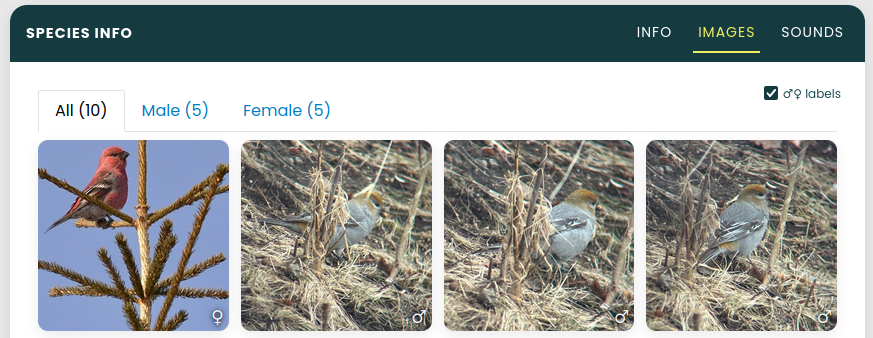
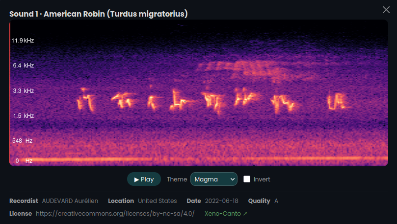

\newpage

## Executive Summary

The Boreal Avian Modelling Centre (BAM) requires a transition from static visuals to a high-fidelity, interactive, analytic platform. The current [site](https://borealbirds.github.io/ "BAM static website"), which showcases Version 4 model outputs, is restricted to data tables and static summaries for 143 species of birds across boreal North America. Version 5 model results introduce improved raster predictions, spatially explicit density estimates, and habitat relationship metrics. We aim to highlight these improvements in the updated dashboard.

The proposed dashboard will be designed to be user-friendly and accessible to a wide range of audiences; including research and conservationists based users, as well as birding enthusiasts and the general public. This will allow users to interactively explore both version 4 and version 5 model outputs. Additionally, the dashboard serves as a landing page for visitors to the site providing easy-access links to existing tools in the BAM portfolio.

@fig-proposed-dashboard provides our current mock-up of the proposed dashboard. The dashboard will include filters, an interactive map, and insightful summary charts/graphs/tables. Navigation will be based on tabs for minimal scrolling and intuitive searching. This *Shiny App* will be initially programmed in Python and hosted on *Posit Connect Cloud.*

{#fig-proposed-dashboard}

## Introduction

### Addressing the Issue

The project motivation is to improve upon and enhance the current static Boreal Avian Modelling Centre (BAM) website.

As the current website does not allow for user input or interaction, this limits the ability to dive in and explore the avian model outputs. As the current audience is mostly advanced users familiar with the domain and statistical software, ensuring a wider level of accessibility can expand end-user reachability.

### Background & Importance

A mandate of BAM's is to support migratory bird management and conservation across the boreal region of North America for 143 species of birds. Using data-driven tools, these applications include:

- bird population and trend estimations

- land-use planning

- understanding of avian-habitat relationships

- ability to investigate population decline of a specific species

To properly address conservation challenges, the tools created should be simple and effective for anyone to use.

### Objectives

@fig-existing-website provides elements from the current BAM website, which will be incorporated into the improved design using @fig-proposed-dashboard as guidance.

High level objectives include:

- Static to dynamic website, changing via user input - maintaining existing figures and visuals.
- Filters, an interactive map, and additional summaries and visuals.
- Accommodate historic and future model versions for reproducibility and validation of performance. (Outputs from earlier models have been thoroughly vetted.)
- Accessible by the general public - serve as a landing page for BAM with links to other existing BAM products and information.

{#fig-existing-website}

### The Product

The final deliverable will be an interactive dashboard allowing users to explore outputs of models v4, v5, and ongoing. We will be meeting with BAM regularly to include or exclude features discussed. @fig-dashboard-features showcases elements of the proposed dashboard.

Keeping with a simple and minimalist approach, we've limited the number of filters and visuals to the most important. Additional components can be housed under tabs reducing scrolling by collating related information together, making searching and navigation more intuitive.

{#fig-dashboard-features}

\newpage

## The Data

### Basic EDA

The main data scope for the dashboard includes model outputs only. These files are stored on Google Drive and include the following:

- **Raster files** **(TIF format)** - For each bird species, the main output of the model containing 3 bands: mean density, standard deviation of density, and the mean distance of species detection.
- **Excel files** - Metadata associated with the bird species, region, and importance of the features.
- **CSV files** - The input to the model, including raw observations binned by Lat/Lon. Used to distinguish between different methods of bird spotting.

For EDA purposes, a single species of bird, the **Canada Warbler**, was used.

Initial EDA for investigating what to expect from the TIF files involved plotting the different color bands shown below in @fig-raster-bands.

```{python}
#| label: fig-raster-bands
#| fig-cap: Split of Raster Data into Bands
#| echo: false

# import rasterio
# from rasterio import *
# import matplotlib.pyplot as plt

# def plot(data):
#     fig, ax = plt.subplots(1, 3, figsize=(12, 4))

#     img = rasterio.open(data)

#     cmaps = ["Mean Abundance", "SD Abundance", "Mean Distance to Species Detection"]
#     bands = ["var 1", "var 2", "var 3"]
#     for band in [1, 2, 3]:
#         ax[band-1].imshow(img.read(band), cmap="YlGn")
#         ax[band-1].set_title(cmaps[band-1])
#         ax[band-1].axis("off")
#     plt.tight_layout()
#     plt.show()

# # Change these selections as needed
# species = 'CAWA'    # BBMA
# region = 'Canada'   
# year = '2020'       # 2015

# filename = f"../data/{species}_{region}_{year}.tif"

# plot(filename)
```

### Data Concerns and Constraints

- Finely detailed raster (TIF): The native TIF files are \~800K predictions per output. This entire high-res output is unnecessarily loaded for every interactive adjustment; even when zooming into a specific region.
- [Coordinate Reference System (CRS)](https://epsg.io/ "CRS EPSG lookup") adjustment: The TIFs arrive formatted with the EPSG:3978 (Statistics Canada Lambert) CRS . This does not allow for caching and every render triggers a full coordinate transformation pass.
- Eager Loading of data: Every filter adjustment triggers a full TIF decode, CRS transformation, and PNG/COG encoding. This bogs down the UI resulting in a laggy and inefficient user experience.

To address this, we are exploring options using the [Cloud-Optimized GeoTIF](https://cogeo.org/ "Cloud-Optimized GeoTIF (COG)") format (COG). COG is analogous to Parquet for tabular data, using internal tiling and HTTP range requests to only render what is being displayed. We are also investigating alternate Lazy-Loading options within Shiny for R, which will be discussed with BAM to ensure future maintainability.

The initial EDA was conducted in *Jupyter Notebooks* and with a locally-run *Shiny App,* which can be reproduced by installing the conda [environment](https://github.com/UBC-MDS/Boreal-Birds/blob/main/environment.yml "environment.yml file") and following the instructions in the [README](https://github.com/UBC-MDS/Boreal-Birds/blob/main/README.md "Boreal-Birds README").

\newpage

## Data Science Approach

### Data Pipeline

@fig-data-pipeline maps out our main pipeline for the dashboard. Following is a breakdown of the individual components of the pipeline.

{#fig-data-pipeline}

#### Data Input

There are 2 data streams which are ingested into the dashboard: outputs from the model and static metadata. The model outputs consist of the different TIF files, one for each species, location, and year in the dataset. The metadata includes information relating to the bird species (including English names, Latin names, genus etc.), location, and region. These will primarily feed into the main filters of the dashboard.

Currently, these files are stored on a Google Drive which are subjected to extended loading (and downloading) times. To improve on speeds, we suggest pre-loading these model outputs to a SQL (or equivalent) database which can be queried through the dashboard's back-end for friction-less responses. Another method which can be applied in congruence is to cache the most frequently loaded data. These approaches will enable fast retrieval and on-demand structured data validation. All approaches to be discussed with BAM.

#### Preprocessing

There is different preprocessing required for both outlined data streams. Since we're dealing with discrete model outputs, the data format can be safely assumed to be standardized.

Before loading the data to the app, we perform some data validation checks on the metadata: column name validation, data type validation, and NaN management.

Preprocessing for TIF files include: color band extraction, CRS validation, and conversion to Cloud Optimized GeoTIF (COG); or equivalent alternatives.

Our plan is to run these preprocessing steps in advance such that it is ready to be ingested into the dashboard at runtime.

#### App

The Shiny app consists of a server and UI. Basic render targets (incorporated by the server) include the following:

- **Bird metadata** - A static table of metadata that can be sliced by filters.
- **Filters** - The filters incorporate metadata from the excel file. These serve as lookup tables for the dashboard and will feed into the main filters in the UI.
- **Main raster** - Simple loading of the different raster bands to memory.
- **Metrics** - Extraction of metrics (mean, sd of abundance, distance from detectors), from raster file.

There is an opportunity for further data metrics derived which shall be explored at a later data and in consultation with BAM.

#### Front End

The front end of the dashboard includes the following visuals - there is opportunity for additional visuals based on feedback and consultation. These will be addressed after the basic structure of the dashboard has been implemented.

- @fig-dashboard-map An interactive map that follows the following format.
- @fig-dashboard-bar-chart A bar chart showing the population densities by region.
- @fig-dashboard-static-table A static table containing raw numeric metrics.

::: {#fig-front-end layout-nrow="2"}
{#fig-dashboard-map}

{#fig-dashboard-bar-chart}

{#fig-dashboard-static-table}

Front End Visuals
:::

\newpage

## Data Product and Results

### Bird Species Details

#### General Information

Species information is displayed through the toggle from *Map* to *Info* and selecting the *Info* tab from the 3 tab options. On a simple UI card, the scientific name, French name, species family, and species code are displayed in a clean and clear layout with links to 4 additional resources for further literature selectively directed towards the selected species.

Additional links are to: [eBird](https://ebird.org/home), [NatureCounts](https://www.naturecounts.ca/nc/default/main.jsp), [Wikipedia](https://en.wikipedia.org/wiki/Bird), [Xeno-Canto](https://xeno-canto.org/)

- @fig-dashboard-info A basic UI card to display species names, species code, and links.


#### Images and Sounds

The images and sounds were obtained through APIs for conservation sites like [Xeno-Canto](https://xeno-canto.org/) and [iNaturalist](https://www.inaturalist.org/). Asset metadata values and tags were utilized to fine tune the download scripts and to refine the desired image and sound parameters. The script for Image downloads attempted to retrieve 10 images per species tagged as a living specimen and aiming for 5 male and 5 female. As about \~3% of images were of poor quality or incorrectly tagged in the metadata manual review and intervention was required for the final quality control of the product. As some bird species are virtually impossible to sex in the field or from an image, the images for these species were binned together in the *All* bucket.

- @fig-dashboard-images-1 The *Images* tab of the Alder Flycatcher - which cannot be sexed


As the sex of many bird species *can* be identified visually, for the species where the sex and relative metadata was manually verified the UI displays 3 bins for *All, Male*, and *Female,* including a check-box to toggle on symbols to subtly label the images with the sexes.

- @fig-dashboard-images-2 The *Images* tab of the Pine Grosbeak with sex labels



The script for sounds attempted to retrieve 2 sounds per bird species, with a length under 7 seconds, and with a quality rating of B or higher within to the sound's metadata. If no sounds were available under 7 seconds then the script would attempt to search for a length of up to 10 seconds, then 15 seconds, and finally allow for 1 sound at 20 seconds. This was to methodically keep asset sizes low because of the volume of assets and considering the storage on GitHub alongside the dashboard code.

Sounds are displayed by selecting the *Sounds* tab and reveal a standard waveform visual with a play button and red line that animates through the waveform as the play-head. Underneath each waveform shows a condensed grey-scale spectrogram which has a tool-tip on hover: "Click for full spectrogram", allowing the user to click the UI and expand the spectrogram fully in a separate modal screen.

- @fig-dashboard-sounds The *Sounds* tab of the American Robin - waveform & spectrogram


The spectrogram modal screen shows the fully expanded dynamically calculated spectrogram for the selected species. The modal also displays the source, attributions, and metadata, along with options for grey-scale, viridis, or magma plotting themes with additional option to invert color-scale.

- @fig-dashboard-spectrogram The expanded spectrogram modal for the American Robin



### Model Results and Exploration

#### Map

#### Population and Density Estimates

#### Covariates

#### Download

### Text-Heavy Elenents

\newpage

# Conclusions and Recommendations

\newpage

## References

**Boreal Avian Modelling Centre**

- Organisation website: <https://borealbirds.github.io/>
- Google Earth Engine viewer: <https://borealbirds-gee.projects.earthengine.app/view/landbirdmodels>
- BAM Shiny explorer: <https://borealbirds.shinyapps.io/bam_landbird_explorer/>
- BAMexploreR R package: <https://github.com/borealbirds/BAMexploreR>
- Landbird Models V5: <https://github.com/borealbirds/LandbirdModelsV5>
- BAM website repository: <https://github.com/borealbirds/borealbirds.github.io>
- Cloud Optimized GeoTIF (COG): <https://cogeo.org/>
- Coordinate Reference System EPSG lookup: <https://epsg.io/>

**Capstone Project Working Repository**

- UBC MDS Boreal-Birds: <https://github.com/UBC-MDS/Boreal-Birds>
- README: <https://github.com/UBC-MDS/Boreal-Birds/blob/main/README.md>
